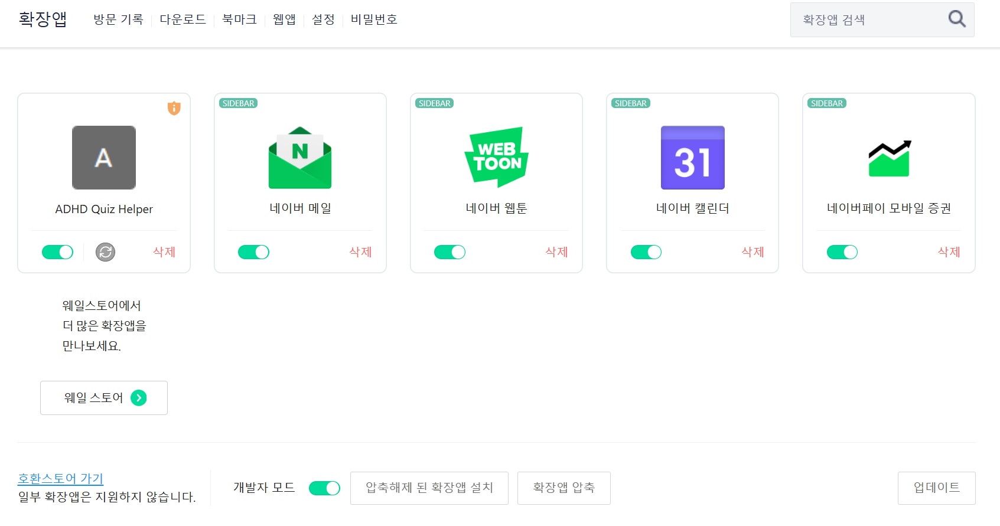
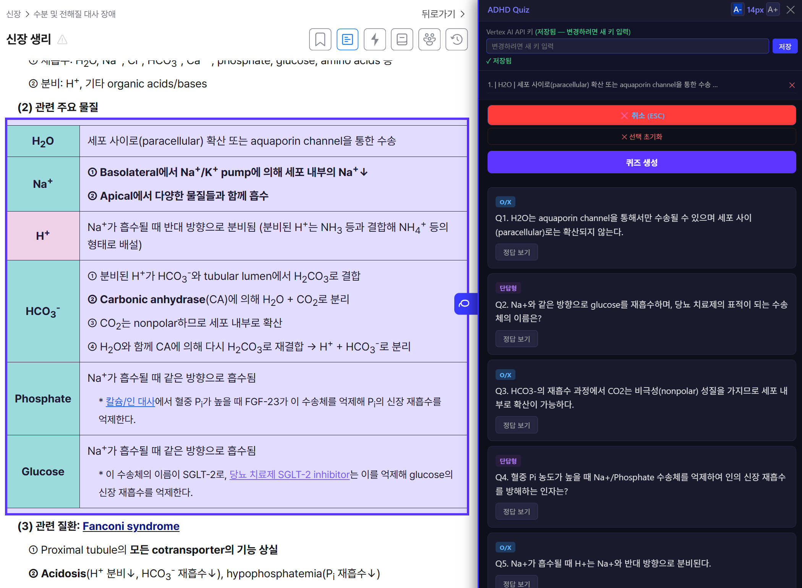

# quick-recall

공부하면서 읽은 내용을 바로 퀴즈로 만들어주는 Chrome 확장.  
복사-붙여넣기 없이 드래그/클릭만으로 AI 퀴즈 생성.

| | |
|:---:|:---:|
|  |  |
| 확장 프로그램 설치 | 사용 예시 |

## 주요 기능

- **DevTools 스타일 요소 선택기** — 호버하면 요소 강조, 클릭으로 선택
- **복수 영역 선택** — 여러 블록 누적 선택 후 한 번에 퀴즈 생성
- **표(rowspan/colspan) 지원** — 병합 셀도 정확히 텍스트 추출
- **복사 방지 우회** — selectstart/copy 이벤트 차단 해제
- **인라인 패널** — 페이지 우측에 고정 패널, 리사이즈 가능

## 기술 스택

- Chrome Extension Manifest V3
- Vertex AI Express Mode → [설정 방법](./vertexai-setup.md)
  ```js
  const MODEL = "gemini-3-flash-preview";

  async function generateQuiz(text) {
    const { adhdApiKey } = await chrome.storage.local.get('adhdApiKey');
    if (!adhdApiKey) throw new Error('API 키가 설정되지 않았습니다. 패널에서 키를 입력해주세요.');

    const prompt = `다음 학습 텍스트로 퀴즈 3~5개를 만들어줘. JSON만 응답해.
  형식: [{"type":"OX","question":"질문","answer":"O"},{"type":"short","question":"질문","answer":"정답"}]
  텍스트:\n${text}`;

    const endpoint = `https://aiplatform.googleapis.com/v1/publishers/google/models/${MODEL}:generateContent?key=${adhdApiKey}`;

    const res = await fetch(endpoint, {
      method: "POST",
      headers: { "Content-Type": "application/json" },
      body: JSON.stringify({
        contents: [{ role: "user", parts: [{ text: prompt }] }],
        generationConfig: { responseMimeType: "application/json" },
      }),
    });

    const data = await res.json();
    if (!res.ok) throw new Error(data.error?.message || "Gemini API 오류");

    const raw = data.candidates?.[0]?.content?.parts?.[0]?.text;
    return JSON.parse(raw);
  }
  ```

## 설치

1. Chrome → `chrome://extensions`
2. 우상단 **개발자 모드** 활성화
3. **압축해제된 확장 프로그램 로드** → `quick-recall/` 폴더 선택

## 파일 구조

```
quick-recall/
├── manifest.json     # 확장 설정 (권한, content script)
├── background.js     # Vertex AI API 호출 (service worker)
├── content.js        # 페이지 삽입 스크립트 (선택기, 패널, 퀴즈 UI)
└── panel.css         # 패널 스타일
```
